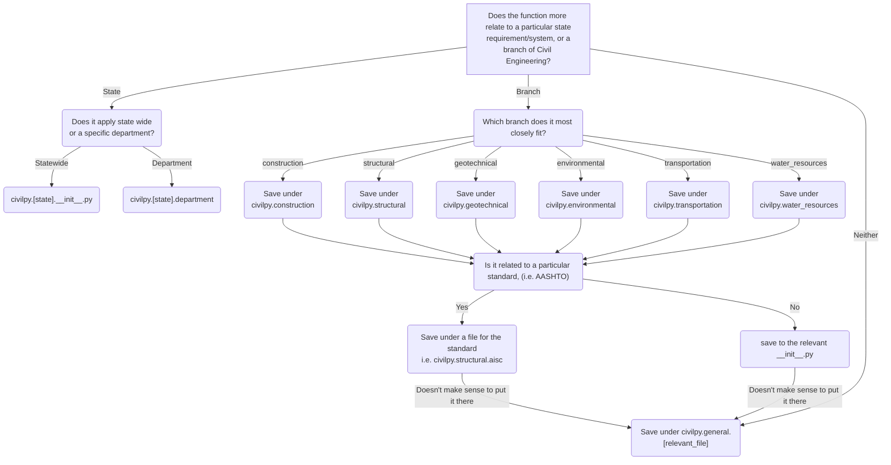

# CivilPy


Code snippets for Civil Engineering related tasks

## About (Skip to the "Installation" section to start running code)

Welcome to the CivilPy repository.  This program is a simple terminal based software package to give users easier access
to some of the packages from the python repository.  The package is focused on civil engineering related tasks such as 
file management, pdf data extraction, image manipulation mapping and unit conversions.  I did my best to make the user 
interface obvious to use and tried to keep the functionality compatible with tools available to the average Civil 
engineer.

## Intro

This repository was created in order for me to gain a better understanding of software development work flows and how they can be
re-purposed for civil engineering related tasks.  This is by no means a comprehensive or even functional repository but 
is more a way for me to track my progress while learning more about another industry.  There may occasionally be how-tos
and other code posted here but this repository is not meant as tutorial or in depth explanation for how coding works. 
For those types of things I highly suggest you instead check <a href=https://www.youtube.com/>Youtube</a> for general 
lessons or <a href=https://stackoverflow.com/>Stack Overflow</a> for specific issues.  I highly recommend the 
<a href=https://www.youtube.com/user/cs50tv>Harvard CS50 YouTube Channel</a> for conceptual level programming lessons or
<a href=https://www.youtube.com/user/schafer5>CoreyMS's Youtube Channel</a> for lessons in practical uses of 
programming. 

## Installation

Run the following code to install the package:

```bash
$ pip install civilpy
```

## Usage

to check the package installed correctly, run:

```python
from civilpy.structural.steel import hello_world

# Test the function imported successfully
hello_world()
```

# Developing CivilPy

To install the development environment, instead of just the bare-bones base package,
you can run the following once setting up your virtual environment:

```bash
$ pip install -e .[dev]
```

# How to determine where to store functions within the package

Here is the decision tree for function organization within the package, the goal
is to keep importing and running functions as simple as possible for non-programmers,
while maintaining an organizational structure capable of supporting many tools.

i.e., the end user should be able to access any of your functions from a simple import:

```python
from civilpy.state.ohio.dot import help_function
```

<div class="center">


</div>
